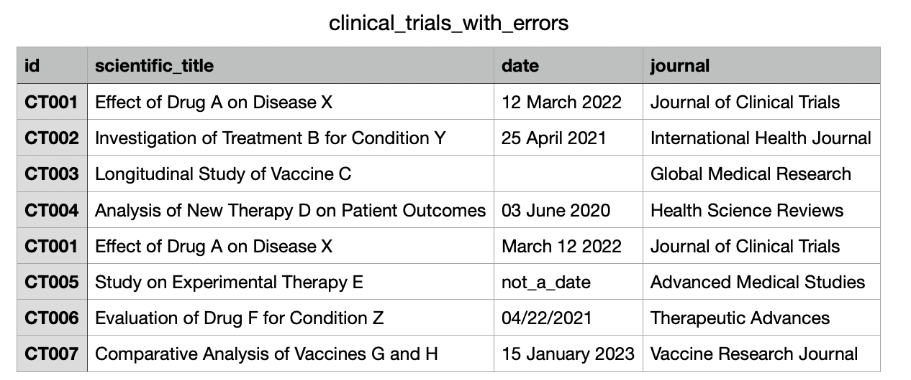
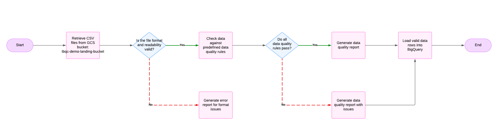
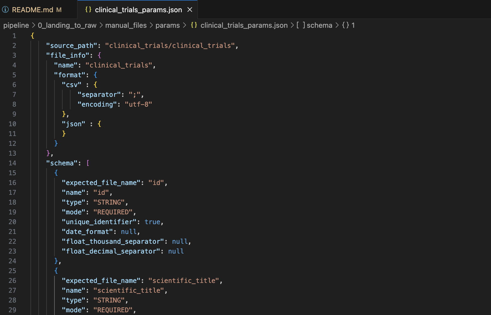
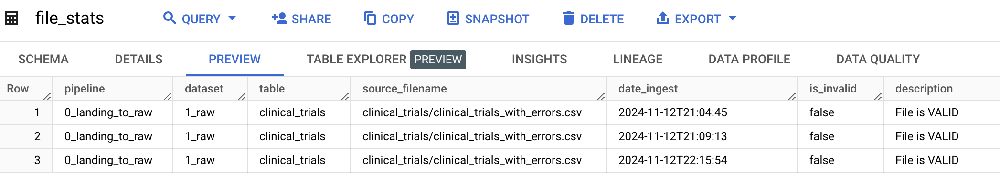
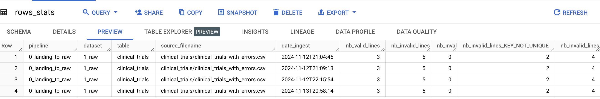
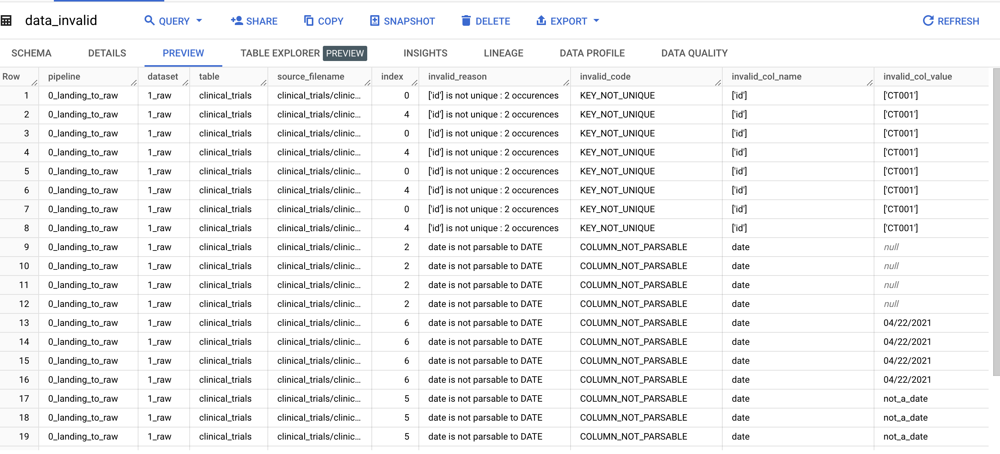
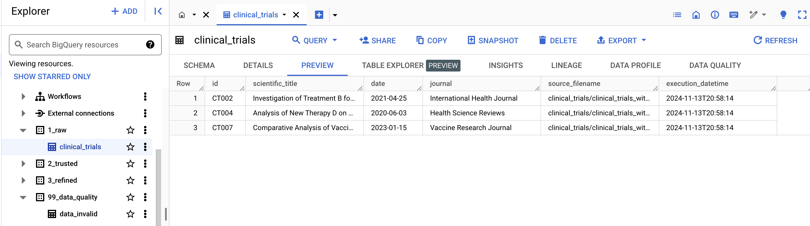

# Landing to Raw Data Quality Checker

This repository contains a Python application that validates and processes CSV data files stored in a Google Cloud Storage (GCS) bucket.

The application is containerized using Docker, stored in Google Artifact Registry, and deployed on Google Cloud Run.

The primary function of this application is to perform data quality checks on CSV files, generate data quality reports, and ingest valid data into BigQuery.

## Table of Contents

- [Overview](#overview)
- [Architecture](#architecture)
- [Data Quality Checks](#data-quality-checks)
- [Output Files and BigQuery Tables](#output-files-and-bigquery-tables)
- [Getting Started](#getting-started)
- [Deployment with Github Actions](#deployment)
- [Configuration](#configuration)

## Overview





The application performs data quality checks on CSV files in a GCS bucket (`tbqc-demo-landing-bucket`), generates reports, and ingests valid data into BigQuery. Key actions include:

1. Validating file format and readability.
2. Checking data against predefined data quality rules (e.g., uniqueness of ID, data types, non-null values).
3. Generating data quality reports.
4. Loading valid data rows into BigQuery.


## Architecture

- **Data Storage**:
  - Input data is stored in a GCS bucket (`tbqc-demo-landing-bucket`) known as the "Landing Zone".
  - Data quality reports and valid data rows are stored in BigQuery.

- **Containerization and Deployment**:
  - The Python application is containerized using Docker and stored in the Google Artifact Registry (`tbqc-demo-ar-application`).
  - Google Cloud Run (`landing-to-raw` service) is used to run the application and orchestrate the data quality checks.


## Configuration



Data quality rules and configurations are defined in a JSON configuration file. This file specifies:

- **Column-specific rules**: Define constraints like uniqueness, non-null constraints, and data type validation.
- **Additional validation rules**: Other custom validation checks specific to your data.

To modify or add new data quality rules, update the JSON configuration file and redeploy the Cloud Run service.


## Data Quality Checks


The application performs the following checks on each CSV file:

1. **File Format Check**: Ensures the file is in a readable CSV format.
2. **Row-Level Checks**:
   - **Uniqueness**: Ensures unique values in specified columns (e.g., unique ID).
   - **Type Validation**: Checks if values are parsable to the defined data types.
   - **Null Value Check**: Ensures non-null values in required fields.
3. **Other Rules**: Additional data quality rules can be added as needed by modifying the configuration file.

## Output Files and BigQuery Tables

After processing each file, the application generates the following data quality files, which are stored in BigQuery under the dataset `99_data_quality`:

1. **file_stats**: Records the status of each ingested file (valid/invalid).



2. **rows_stats**: Summarizes the number of valid and invalid rows per ingested file based on the quality checks.



3. **data_invalid**: Contains detailed information about each invalid row and the reason for its invalidity.



All valid data rows from processed files are stored in the `1_raw` dataset in BigQuery.



## Getting Started

### Prerequisites

- **Google Cloud Platform**: Access to Google Cloud services including GCS, BigQuery, Artifact Registry, and Cloud Run.
- **Python 3.x**: For running the application locally and managing dependencies.

### Setup (MacOs)

1. **Create a virtual Python Environment**:
   ```bash
   python -m venv .env
   `````
2. **Activate the virtual Python Environment**:
   ```bash
   source .env/bin/activate
   `````
3. **Run the env.sh file to set the environment variables**:
   ```bash
   source env.sh
   `````
4. **Install the required packages**:
   ```bash
   pip install -r pipeline/requirements.txt 
   `````
5. **Finally, run the python fonction**:
   ```bash
   python pipeline/0_landing_to_raw/manual_files/0_landing_to_raw.py 
   `````

## Deployment

## Continuous Deployment with GitHub Actions

This repository includes a GitHub Actions workflow that automates the build and deployment process for the application on Google Cloud Run. The workflow file, located at `.github/workflows/deploy.yml`, is configured to deploy updates whenever changes are pushed to the `main` branch.

### Workflow Summary

- **Trigger**: Runs on each push to the `main` branch.
- **Environment**: Uses the latest Ubuntu runner (`ubuntu-latest`).
- **Google Cloud Authentication**: Authenticates to Google Cloud using a service account key stored as a GitHub secret (`GCP_SERVICE_ACCOUNT_KEY`).
- **Artifact Registry**: Builds and pushes a Docker image to Google Artifact Registry.
- **Cloud Run Deployment**: Deploys the latest Docker image to Cloud Run.

### Workflow Steps

1. **Checkout Code**: Checks out the latest code from the repository.
2. **Authenticate to Google Cloud**: Authenticates using the provided service account key.
3. **Set Up Cloud SDK**: Configures the Google Cloud SDK for the deployment.
4. **Configure Docker for Artifact Registry**: Configures Docker to use Google Artifact Registry.
5. **Build Docker Image**: Builds the Docker image locally with the required tags.
6. **Push Docker Image**: Pushes the Docker image to Google Artifact Registry.
7. **Deploy to Cloud Run**: Deploys the newly built image to Cloud Run as an unauthenticated service.

This workflow enables continuous deployment, automatically deploying updates to Cloud Run after each push to `main`. The service is set to run in the `europe-west1` region and is accessible without authentication.


## Potential Enhancements

To further improve the functionality and reliability of this application, consider implementing the following enhancements:

1. **Unit and Integration Testing**:
   - Implement unit tests to validate individual functions and methods, ensuring core logic works as expected.
   - Add integration tests to validate the entire data pipeline, including data retrieval from Google Cloud Storage, data quality checks, and BigQuery ingestion.
   - Automate testing as part of the CI/CD pipeline, so tests run with every push or pull request.

2. **Enhanced Data Quality Checks**:
    - **Range Checks**: Ensure values fall within specified minimum and maximum thresholds (e.g., age between 0 and 120).
    - **Pattern Matching**: Use regular expressions to ensure values match expected patterns (e.g., email format validation, postal code structure).

3. **Code Quality and Linting**:
   - Integrate `pylint` to maintain clean, readable, and consistent code.
   - Enforce linting checks as part of the CI/CD workflow to prevent code with issues from being deployed.
   - Consider using `black` or `autopep8` to automatically format code according to PEP 8 standards.

4. **Performance and Scalability Optimization**:
   - Optimize data processing by implementing batch processing to handle larger files and increase efficiency.
   - Consider parallelizing row-level checks for better performance on large datasets.
   - Explore additional Cloud Run configuration options (e.g., CPU and memory allocation) for optimal application scaling.

5. **Improved Logging and Monitoring**:
   - Implement structured logging with Google Cloud Logging to better track processing and quality check results.
   - Set up monitoring and alerts for Cloud Run and BigQuery to proactively detect issues and errors.
   - Capture metrics on processing time, error rates, and data validation statistics to monitor performance over time.

6. **Detailed Error Reporting**:
   - Enhance error handling to provide more descriptive error messages in the `data_invalid` table.
   - Implement a notification system (e.g., sending alerts via email or Slack) for critical failures or large volumes of invalid data.